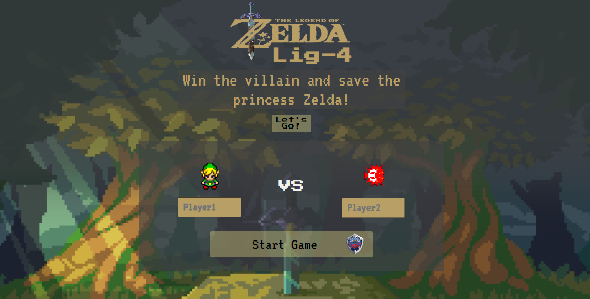
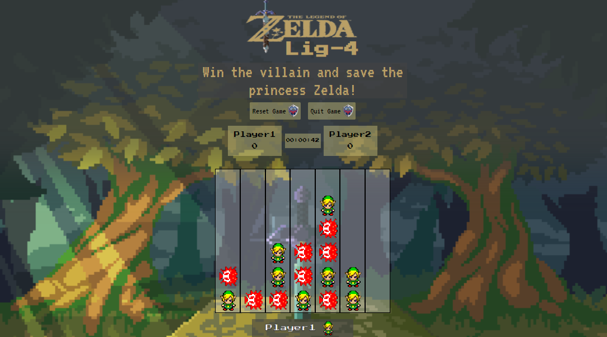

<!-- CABEÇALHO -->

    <h1>
        Lig-4 Zelda ⚔️
    </h1>
    
    

        <a href="#%EF%B8%8F-sobre-o-projeto">Sobre o Projeto</a> •
        <a href="#-layout">Layout</a> •
        <a href="#%EF%B8%8F-tecnologias">Tecnologias</a> •
        <a href="#-autor">Autor</a>
    

<!-- SOBRE O PROJETO -->

## 🖥️ Sobre o Projeto

    
     
     
    

 

> Esse projeto foi realizado como parte das atividades de ensino na Kenzie Academy Brasil.

O projeto teve como objetivo exercitar o trabalho em equipe e desenvolver o jogo Lig-4 utilizando os conceitos de HTML, CSS e JavaScript aprendidos durante o curso.

No Lig-4, dois jogadores assumem peças diferentes (geralmente diferenciadas por cores ou formatos). Os jogadores se alternam inserindo suas peças em uma das 7 colunas de uma tabela 7x6. O primeiro jogador que conseguir quatro de suas peças em uma linha (seja horizontal, vertical ou diagonal) vence. O jogo pode terminar em empate quando todas as células estiverem preenchidas e nenhum jogador conseguir quatro peças em linha.

<!-- LAYOUT -->

## 🎨 Layout

  

<!-- TECNOLOGIAS -->

## 🛠️ Tecnologias

Para o desenvolvimento desse projeto, as seguintes ferramentas foram utilizadas:

- **[HTML](https://developer.mozilla.org/en-US/docs/Web/HTML)**
- **[CSS](https://developer.mozilla.org/en-US/docs/Web/CSS)**
- **[JavaScript](https://developer.mozilla.org/en-US/docs/Web/JavaScript)**
- **[DOM](https://developer.mozilla.org/en-US/docs/Web/API/Document_Object_Model)**

## 👨‍💻 Autores

 Marcos Kenji Kuribayashi  

Maykel Nekel 

Vinícius Troyack 

---
